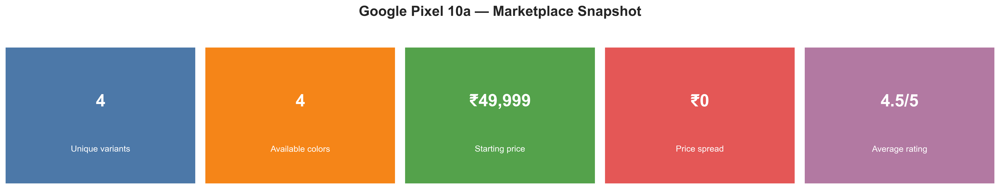
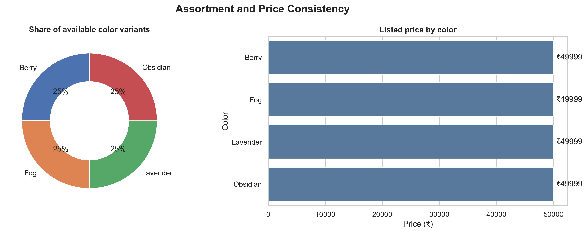

# Google Pixel 10a — Marketplace Pricing & Product Analysis

## Project Overview

This project analyzes marketplace data for the Google Pixel 10a to evaluate product assortment, pricing consistency, color variants, and customer ratings.

The analysis focuses on transforming marketplace product information into structured insights that can support pricing analysis, product positioning, and competitive marketplace evaluation.

---

## Objectives

- Analyze the available Google Pixel 10a product variants.
- Evaluate color and variant availability.
- Examine marketplace pricing consistency across variants.
- Analyze customer ratings.
- Identify the relationship between product assortment and pricing.
- Present key marketplace findings through data visualizations.

---

## Key Metrics

The analysis evaluates the following marketplace indicators:

| Metric | Value |
|---|---:|
| Unique Variants | 4 |
| Available Colors | 4 |
| Starting Price | ₹49,999 |
| Price Spread | ₹0 |
| Average Rating | 4.5/5 |

---

## Product Assortment

The analysis identifies four available color variants:

- Berry
- Obsidian
- Fog
- Lavender

Each color represents an equal share of the available variants in the analyzed marketplace data.

---

## Pricing Analysis

The listed marketplace price is analyzed across all available color variants.

### Pricing Findings

- Listed price: **₹49,999**
- Price is consistent across the analyzed color variants.
- Price spread across the available colors: **₹0**
- No color-based price variation was identified in the analyzed marketplace snapshot.

---

## Customer Rating Analysis

The marketplace data reports an average customer rating of:

**4.5 / 5**

This metric is used as an indicator of customer feedback for the analyzed product listings.

---

## Analysis Areas

### 1. Product Assortment

Analysis of:

- Number of unique variants
- Available colors
- Variant distribution

### 2. Pricing Consistency

Analysis of:

- Listed price by color
- Starting price
- Price variation
- Price spread

### 3. Customer Rating

Analysis of:

- Average product rating
- Marketplace customer feedback

---

## Dashboard

The project includes visual analysis of:

- Marketplace KPI metrics
- Color variant distribution
- Listed price by color
- Product assortment
- Pricing consistency

### Dashboard Preview





---

## Tools & Technologies

- Python
- Pandas
- Data Cleaning
- Data Analysis
- Data Visualization
- Excel
- Jupyter Notebook

---

## Data Collection

The marketplace information was collected and structured for analytical purposes.

The project demonstrates a complete workflow from marketplace data collection and preparation to analysis and visualization.

---

## Project Workflow

```text
Marketplace Data
       ↓
Data Collection
       ↓
Data Cleaning
       ↓
Data Preparation
       ↓
Exploratory Data Analysis
       ↓
Pricing & Variant Analysis
       ↓
Data Visualization
       ↓
Business Insights
